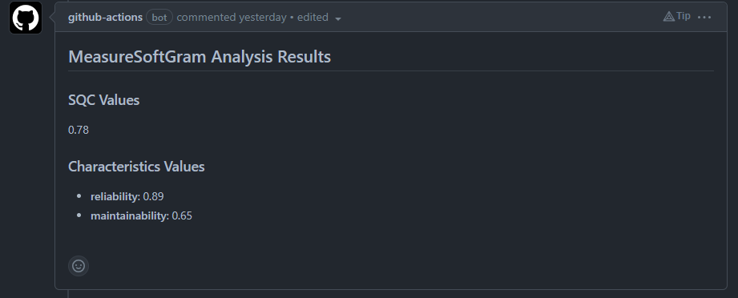

# 2023-1-MeasureSoftGram-Action

Esta é uma ação do Github que executa o [Msgram-CLI](https://github.com/fga-eps-mds/2023-1-MeasureSoftGram-CLI), baseando-se nos resultados dos testes de ferramentas de analise de codigo como o Sonarqube, e adiciona os resultados como anotações em seus pull requests. 

**Nota:** Esta ação é destinada a ser executada quando um pull request é feito para as branches main ou develop.

## Sobre o Msgram
O Msgram é um robusto sistema de gerenciamento e avaliação de qualidade de software. Ele atua como uma ferramenta de apoio ao planejamento e comparação das qualidades nas releases, fornecendo uma análise abrangente da qualidade do produto e do processo. Ele retorna valores das métricas analisadas de software e avalia a qualidade a partir de modelos algébricos, analisando múltiplos atributos de qualidade. O Msgram é um projeto de software livre, com foco em prover uma ferramenta acessível e eficiente para a gestão da qualidade do software.

## Exemplo de Saída



## Uso
Para criar um novo fluxo de trabalho do GitHub Actions no seu repositório GitHub (por exemplo, `msgram-analysis.yml`), você deve ir para o diretório `.github/workflows`. No novo arquivo, insira o seguinte código:

```yaml
on:
  pull_request:
    branches: [ main ]

jobs:
  msgram_analysis:
    runs-on: ubuntu-latest
    name: Análise Msgram
    steps:
      - name: Checkout
        uses: actions/checkout@v3
      - name: Msgram analysis action step
        uses: ./ # Usa uma ação no diretório raiz
        id: msgram
        with:
          githubToken: ${{ secrets.GITHUB_TOKEN }}
          projectKey: "fga-eps-mds_2023-1-MeasureSoftGram-Front"
          msgramConfigPath: "./.github/input/msgram.json"
```

É necessário que você disponha do seu token do GitHub para executar o Msgram.

Recomendamos o uso dos [Segredos do GitHub](https://docs.github.com/pt/actions/security-guides/encrypted-secrets#creating-encrypted-secrets-for-a-repository) para armazenar esta credencial de forma segura ao referenciar o token do GitHub.

## Entradas

| entrada | obrigatório | descrição |
| ------- | ----------- | --------- |
| `githubToken` | sim | O token do GitHub Actions, como `secrets.GITHUB_TOKEN` |
| `projectKey` | não | A chave do projeto, como "fga-eps-mds_2023-1-MeasureSoftGram-Front" |
| `msgramConfigPath` | não | O caminho para o arquivo de configuração do Msgram, como "./.github/input/msgram.json" |


<!-- ## Configuração
Os padrões usados para identificar referências a variáveis no seu código são totalmente personalizáveis.
Esta ação usa o [Msgram](https://github.com/fga-eps-mds/2023-1-measuresoftgram-action) por trás dos panos, para detalhes sobre como configurar a correspondência de padrões, consulte a [configuração do Msgram](https://github.com/fga-eps-mds/2023-1-measuresoftgram-action#configuração). -->

## Roadmap

Estamos sempre trabalhando para melhorar e expandir as capacidades do Msgram. Aqui estão algumas atualizações planejadas:

- [ ] **Persistência das métricas:** Em futuras atualizações, planejamos permitir o armazenamento das informações geradas pela action (no Github ou no serviço web).
- [ ] **Configurações personalizáveis via web:** Planejamos permitir que o usuário altere as configurações a partir do input da ação, puxando do serviço web.
- [ ] **Expansão da integração do Parser:** O [Parser](https://github.com/fga-eps-mds/2023-1-MeasureSoftGram-Parser) irá expandir sua integração com ferramentas de análise para além do SonarQube.
- [ ] **Badges no README:** Planejamos adicionar uma funcionalidade que permitirá aos usuários exibir badges com métricas no README do seu repositório. Com isso, você poderá fornecer uma visão rápida da qualidade do software diretamente no seu README.

